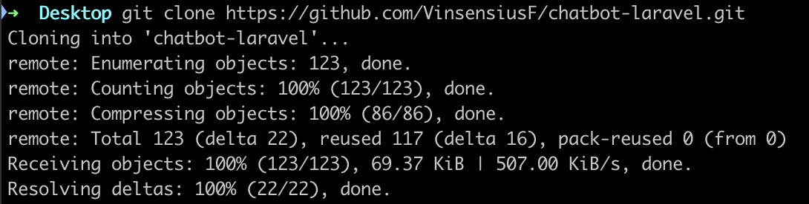

# Chatbot Laravel

## Deskripsi
Ini adalah proyek aplikasi chatbot sederhana yang dibangun dengan Laravel. Aplikasi ini memungkinkan pengguna untuk berkomunikasi dengan bot melalui sesi obrolan yang disimpan. Proyek ini menggunakan PostgreSQL sebagai database dan mencakup fitur penyimpanan sesi obrolan serta respons bot berdasarkan input pengguna.

## Prasyarat
Sebelum Anda mulai, pastikan Anda telah menginstal perangkat lunak berikut di mesin Anda:

- **PHP** 
- **Composer** 
- **PostgreSQL** 
- **NPM** 
- **Git** (untuk meng-clone repository)

## Instalasi

### 1. Clone Repository
Pertama, clone repository ini ke direktori lokal Anda:

```bash
git clone https://github.com/VinsensiusF/chatbot-laravel.git
cd chatbot-laravel
```


### 2. Install Dependency PHP dengan Composer
Jalankan perintah berikut untuk menginstal semua dependency PHP yang diperlukan:

```bash
composer install
```

Hasil composer install akan selesai seperti gambar dibawah:


Kemudian, buatlah file .env dan masukkan code berikut:

```bash
APP_NAME=Laravel
APP_ENV=local
APP_KEY=base64:BWelNJ2MJr2NhoqboEY7WrGsIIWIp7Idva723YyLIvU=
APP_DEBUG=true
APP_TIMEZONE=UTC
APP_URL=http://localhost

APP_LOCALE=en
APP_FALLBACK_LOCALE=en
APP_FAKER_LOCALE=en_US

APP_MAINTENANCE_DRIVER=file
# APP_MAINTENANCE_STORE=database

BCRYPT_ROUNDS=12

LOG_CHANNEL=stack
LOG_STACK=single
LOG_DEPRECATIONS_CHANNEL=null
LOG_LEVEL=debug

DB_CONNECTION=pgsql
DB_HOST=127.0.0.1
DB_PORT=5432
DB_DATABASE=chatbot
DB_USERNAME=postgres
DB_PASSWORD=postgres

SESSION_DRIVER=database
SESSION_LIFETIME=120
SESSION_ENCRYPT=false
SESSION_PATH=/
SESSION_DOMAIN=null

BROADCAST_CONNECTION=log
FILESYSTEM_DISK=local
QUEUE_CONNECTION=database

CACHE_STORE=database
CACHE_PREFIX=
CACHE_DRIVER=database

MEMCACHED_HOST=127.0.0.1

REDIS_CLIENT=phpredis
REDIS_HOST=127.0.0.1
REDIS_PASSWORD=null
REDIS_PORT=6379

MAIL_MAILER=log
MAIL_HOST=127.0.0.1
MAIL_PORT=2525
MAIL_USERNAME=null
MAIL_PASSWORD=null
MAIL_ENCRYPTION=null
MAIL_FROM_ADDRESS="hello@example.com"
MAIL_FROM_NAME="${APP_NAME}"

AWS_ACCESS_KEY_ID=
AWS_SECRET_ACCESS_KEY=
AWS_DEFAULT_REGION=us-east-1
AWS_BUCKET=
AWS_USE_PATH_STYLE_ENDPOINT=false

VITE_APP_NAME="${APP_NAME}"
```

### 3. Konfigurasi dan Pembuatan Database
Buatlah koneksi dan database dengan konfigurasi seperti pada potongan code .env dibawah:
```bash
DB_CONNECTION=pgsql
DB_HOST=127.0.0.1
DB_PORT=5432
DB_DATABASE=chatbot
DB_USERNAME=postgres
DB_PASSWORD=postgres
```

Setelah database dibuat, lakukan migrasi untuk membuat tabel database dengan code dibawah:
```bash
php artisan migrate
```


Pembuatan Koneksi:

Pembuatan Database:


### 4. Menjalankan Aplikasi
Jalankan server pengembangan Laravel dengan perintah berikut:
```bash
php artisan serve
```

Jalankan code berikut untuk mendapatkan list Endpoint yang dapat digunakan:
```bash
php artisan route:list
```

